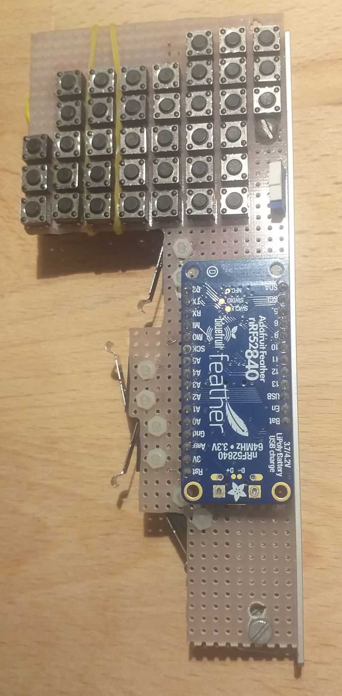
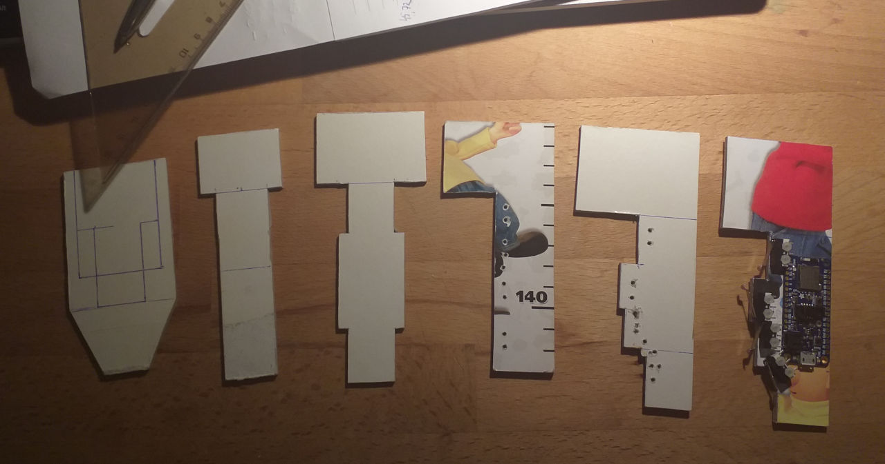
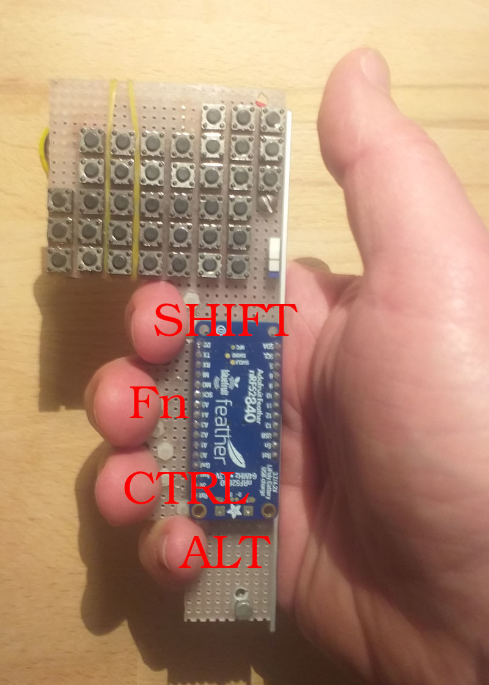
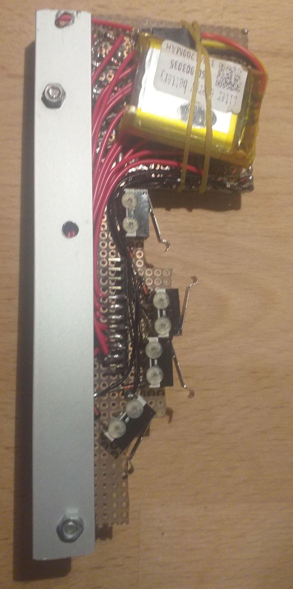
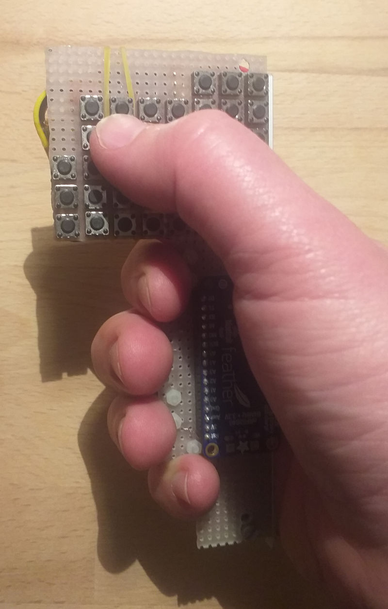

# Single-hand-held bluetooth thumb keyboard

Full keyboard mobile equivalent because you've always wanted to use Vim in Tmux on your mobile while commuting by bus, right?

## Introduction

I hate on-screen keyboards. No amount of inovation or training brings it's typing experience anywhere close to the joy of using the good old Blackberry phone. Unfortunately number of hardware keyboard phones keeps decreasing. There are several variants of bluetooth thumb keyboards available but they always make some compromises which I don't like - some has to be held by both hands, some lacks special keys and chording keyboards turned out to be too difficult for me even though I invested into the [best one](https://twiddler.tekgear.com/). Due to this desperation I decided to try to design my own perfect mobile keyboard.

## Evolution

At first I intended to create just minimalistic rectangle full of buttons that would fit in my hand but when I tested a cardboard form prototype I noticed it's not very convenient. I started to make adjustments which I again tested on a cardboard prototypes and soon several branches of promising designs evolved from these iterations. It was interesting how weird shapes came out when I judged them only by the ergonomics. Then I chose one of the designs and created a functional prototype.

## Key ideas

### Hybrid of thumb keyboard and chording keyboard

Thumb keyboards are simple to use but they would be too large for one hand if they contain all the buttons of full keyboard. Chording keyboards solve this but they require a long training and even then using them may be unpleasant. And both of them does not support simultaneous key presess, which are widely used on PC (Ctrl+c), very well.

I wanted to design primarily a thumb keyboard but I also want to put other fingers to work occasionally, just enough to achieve functional parity with full keyboard. Next idea is the key to this compromise.

### Physical and logical keypress inversion

How to achieve design that can be held by single hand which would at the same time allow pressing multiple button combinations at once? By reversing the keypress logic for fingers other than thumb - the key is logicaly pressed when it's physically released. That way fingers may hold the keyboard most of the time while thumb writes and when a modifier keypress is occasionally needed, respective finger is lifted, but the keyboard is still held firmly by the other modifier fingers.

### Electronic design

No big idea here, the keyboard is basic 6x7 keypad matrix, just with a bit fancy layout reflecting the desired ergonomics, soldered on prototyping board. All the logic is caried out by Adafruit Feather nRF52840 which provides very simple API for all required functions from li-ion battery charging to Bluetooth.

## FAQ

<dl>
	<dd>What's the nature of this project?</dd>
	<dt>Personal hobby sideproject. No intention to develop real product and high probability of usual fate of sideprojects.</dt>
	<dd>Are any of these ideas protected by any intellectual property?</dd>
	<dt>I haven't done any research so I don't know and I don't intend to protect it myself. Even if someone takes this repository verbatim and makes it a proper commercial product I would be happy and I would be their first customer.</dt>
</dl>

### Isn't the left side too far for the thumb?

No, because the thumb is not actually stretching all the way to the left, but instead the other fingers turn the whole keyboard bringing the left side close to the thumb. This is one of the things that's hard to explain or imagine without experiencing it on the prototypes.

